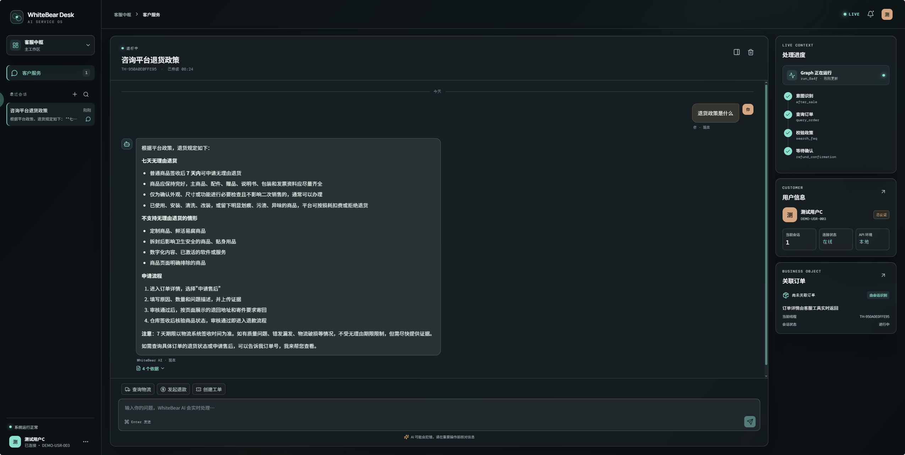
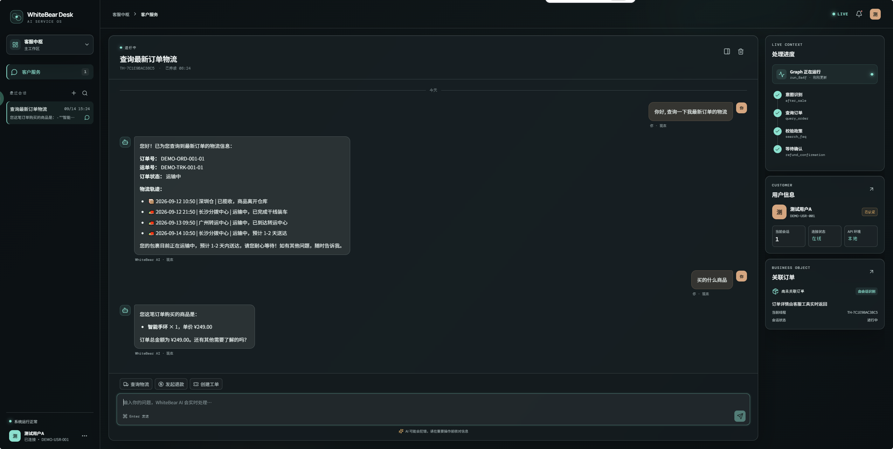
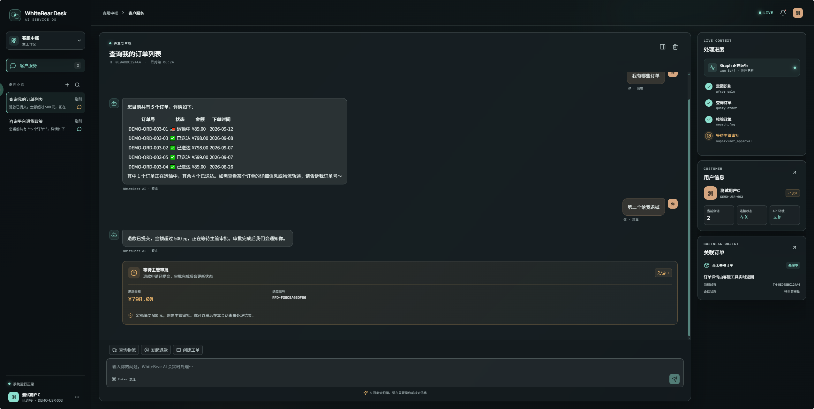
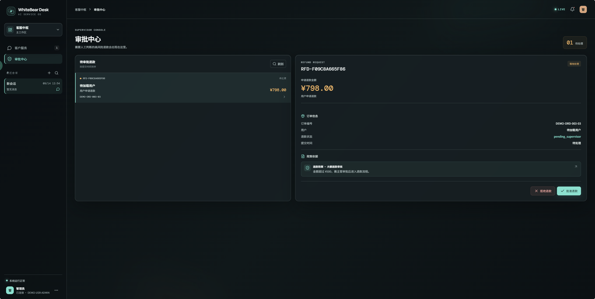
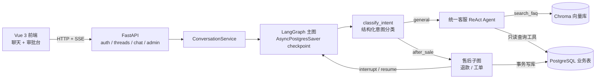

# Smart Customer Service

[](LICENSE)

基于 **LangGraph + FastAPI + Vue 3** 的全栈智能客服演示系统:不只是问答,还能查订单/物流、创建工单、办理退款。
小额退款由用户在聊天中确认,大额退款自动升级为主管审批(Human-in-the-Loop),全程支持多轮对话记忆与 SSE 流式输出。
所有业务数据均为本地模拟数据,适合作为 LangChain / LangGraph 工程化落地的学习与参考项目。

## 📸 界面预览

| RAG 知识问答(附来源引用) | 查询物流轨迹 |
|---|---|
|  |  |

| 大额退款(HITL 确认 / 审批) | 管理员审批台 |
|---|---|
|  |  |

## ✨ 功能特性

| 能力 | 说明 |
|---|---|
| 智能意图路由 | 结构化 LLM 意图分类:普通咨询进入统一客服 ReAct Agent,售后写操作进入受控售后子图 |
| RAG 知识问答 | Markdown 政策文档切分入库(Chroma),回答附带来源引用 |
| 工具调用 | 订单 / 物流 / 工单 / 退款状态只读查询工具,由 Agent 自主决策调用 |
| 人工介入(HITL) | LangGraph `interrupt()` 挂起 → 前端确认卡片 → `Command(resume=)` 恢复执行 |
| 大额退款审批 | 金额超过阈值(默认 ¥500)时挂起,主管在管理端批准/拒绝后恢复图执行 |
| 多轮对话记忆 | `AsyncPostgresSaver` checkpoint,`thread_id` 级会话隔离与恢复 |
| SSE 流式输出 | `run.started` / `message.delta` / `message.completed` / `run.interrupted` / `run.failed` / `stream.done` 多事件协议 |
| 会话管理 | 自动生成标题、游标分页、删除会话时同步清理 LangGraph checkpoint |
| 管理审批台 | 管理员查看待审批退款、执行审批,并自动恢复挂起会话 |

> 安全边界:`user_id` / `thread_id` / 数据库会话均由运行时注入,不信任模型输出;写操作统一收敛到 service 层事务,管理员审批不经过 Agent 工具。

## 🏗️ 系统架构



更细的主图与售后子图流程图(Mermaid 源码)见 [`graph_design/`](graph_design/)。

## 🛠️ 技术栈

- **后端**:Python 3.11+ · FastAPI · SQLAlchemy 2.0 · psycopg 3 · SSE
- **Agent 编排**:LangChain · LangGraph(`create_react_agent` / `interrupt` / `Command`)· `langgraph-checkpoint-postgres`
- **模型**:阿里云百炼 `qwen-plus` + `text-embedding-v4`,OpenAI 兼容接口接入(可替换为其他兼容服务)
- **存储**:PostgreSQL 16(业务表 + LangGraph checkpoint)· Chroma(本地持久化向量库)
- **前端**:Vue 3 · Vite · TypeScript

## 🚀 快速开始

### 环境要求

- Python 3.11+
- Node.js 20.19+ 或 22.12+(Vite 8 的要求)
- PostgreSQL 16,并已创建空数据库(表结构由脚本创建)
- 阿里云百炼 API Key(或任意 OpenAI 兼容服务的 Key)

### 1. 安装后端依赖并配置环境

```bash
python -m venv .venv
# Windows PowerShell:
.\.venv\Scripts\Activate.ps1
# macOS / Linux:
# source .venv/bin/activate

pip install -r requirements.txt
# Windows:
Copy-Item .env.example .env
# macOS / Linux:
# cp .env.example .env
```

编辑 `.env`,至少填写 `LLM_API_KEY`(即 DashScope API Key),并确认 PostgreSQL 连接串、`JWT_SECRET_KEY` 等配置。完整变量说明见[下文](#️-环境变量)。

### 2. 初始化数据库与知识库

```bash
python scripts/create_tables.py               # 创建业务表 + checkpoint 表(幂等,不清空数据)
python data/generate_mock_data.py --replace   # 生成演示用户 / 订单 / 物流模拟数据
python scripts/ingest_knowledge.py --recreate # 切分政策文档并构建 Chroma 知识库
```

### 3. 启动后端

```bash
python -m app.server   # 默认监听 http://localhost:8000
```

> 推荐使用 `python -m app.server` 入口:它在 Windows 上自动切换到 `SelectorEventLoop`,兼容 psycopg 异步连接。

### 4. 启动前端

```bash
cd frontend
npm install
npm run dev   # http://localhost:5174,已配置 /api 代理到后端 8000
```

### 5. 登录体验

打开 <http://localhost:5174>,输入演示用户 ID 即可登录(演示模式无需密码):

| 用户 ID | 演示场景 |
|---|---|
| `DEMO-USR-001`(测试用户A) | 运输中订单 → 查询物流轨迹 |
| `DEMO-USR-002`(测试用户B) | 签收 3 天小额订单 → 退款用户确认(HITL) |
| `DEMO-USR-003`(测试用户C) | 签收 2 天大额订单 → 触发主管审批 |
| `DEMO-USR-004`(测试用户D) | 签收 15 天 → 依政策拒绝退款 |
| `DEMO-USR-ADMIN`(管理员) | 切换到审批台,处理待审批退款 |

试试这样问:

- “我的订单到哪了?” → 物流轨迹列表
- “退货政策是什么?” → RAG 知识问答(附来源)
- “我的订单 DEMO-ORD-002-02 要退款” → 进入退款确认 / 审批 / 政策拒绝分支(取决于演示数据)

## ⚙️ 环境变量

完整模板见 [`.env.example`](.env.example),主要变量:

| 变量 | 说明 |
|---|---|
| `LLM_API_KEY` / `DASHSCOPE_API_KEY` | 百炼 API Key(`DASHSCOPE_API_KEY` 是服务商原生命名,应用读取 `LLM_API_KEY`) |
| `LLM_BASE_URL` | OpenAI 兼容接口地址,默认百炼 `https://dashscope.aliyuncs.com/compatible-mode/v1` |
| `LLM_MODEL` / `EMBEDDING_MODEL` | 对话模型与向量模型,默认 `qwen-plus` / `text-embedding-v4` |
| `DATABASE_URL` | 业务数据库连接串(SQLAlchemy 格式) |
| `CHECKPOINT_DATABASE_URL` | LangGraph checkpoint 库连接串,缺省复用 `DATABASE_URL` |
| `CHECKPOINT_POOL_*` | checkpoint 连接池大小与超时 |
| `CHROMA_PERSIST_DIRECTORY` | Chroma 向量库持久化目录 |
| `KNOWLEDGE_BASE_PATH` | 知识库 Markdown 文档目录 |
| `CORS_ORIGINS` | 允许的前端来源,默认 Vite 开发服务器 `http://localhost:5174` |
| `JWT_SECRET_KEY` / `JWT_ALGORITHM` / `ACCESS_TOKEN_EXPIRE_MINUTES` | JWT 签发配置 |
| `DEMO_AUTH_ENABLED` | 演示登录开关(仅凭用户 ID 登录);生产环境强制要求关闭 |
| `REFUND_APPROVAL_THRESHOLD` | 大额退款审批阈值,默认 500(元) |

## 🔌 API 概览

| 方法 | 路径 | 说明 |
|---|---|---|
| `POST` | `/api/v1/auth/login` | 演示登录,返回 JWT |
| `GET` / `POST` | `/api/v1/threads` | 会话列表(游标分页)/ 创建会话 |
| `GET` / `DELETE` | `/api/v1/threads/{thread_id}` | 会话详情 / 删除会话(含 checkpoint 清理) |
| `GET` | `/api/v1/threads/{thread_id}/messages` | 恢复历史消息与待处理操作 |
| `POST` | `/api/v1/threads/{thread_id}/runs` | 同步执行一轮对话 |
| `POST` | `/api/v1/threads/{thread_id}/runs/stream` | SSE 流式对话 / 恢复挂起会话 |
| `GET` | `/api/v1/admin/refunds/pending` | 待审批退款列表(管理员) |
| `POST` | `/api/v1/admin/refunds/{refund_id}/decision` | 审批并恢复挂起会话(管理员) |
| `GET` | `/health` · `/health/ready` | 存活 / 就绪探针 |

启动后可访问 <http://localhost:8000/docs> 查看完整 OpenAPI 文档。

## 📁 项目结构

```text
smart-customer-service/
├── app/
│   ├── api/            # FastAPI 路由与 Pydantic 契约(auth / threads / chat / admin)
│   ├── db/             # SQLAlchemy 2.0 模型与会话
│   ├── nodes/          # LangGraph 节点(意图分类 / 客服 Agent / 售后子图)
│   ├── rag/            # 文档加载切分与 Chroma 检索器
│   ├── services/       # 业务规则与事务(唯一真相来源)
│   ├── tools/          # LangChain 工具(FAQ 检索 / 只读查询 / 写操作适配)
│   ├── main.py         # FastAPI 应用 + lifespan(graph 与连接池生命周期)
│   ├── server.py       # uvicorn 启动入口(Windows 事件循环兼容)
│   ├── graph.py        # LangGraph 主图组装
│   ├── llm.py          # LLM / Embedding 客户端构建
│   └── state.py        # 图状态定义
├── data/
│   ├── generate_mock_data.py   # 演示数据生成(稳定 DEMO-* 标识,可重复执行)
│   └── knowledge/              # 退款 / 退换货 / 物流 / 会员 / FAQ 政策文档
├── frontend/           # Vue 3 + Vite + TypeScript 聊天与审批界面
├── graph_design/       # 主图 / 售后子图 Mermaid 源码
├── scripts/            # 建表、知识库入库脚本
└── requirements.txt
```

## 📚 更多文档

- [`scripts/README.md`](scripts/README.md) — 数据库初始化细节
- [`graph_design/`](graph_design/) — LangGraph 主图 / 售后子图流程图

## ⚠️ 已知限制

- 演示登录(`DEMO_AUTH_ENABLED=true`)仅凭用户 ID 签发 JWT,无密码校验;配置校验已强制生产环境必须关闭该模式并使用强密钥。
- 所有业务数据均为模拟数据,未对接真实支付 / 物流系统。
- 意图分类与 Agent 行为依赖所选模型效果,不同 OpenAI 兼容提供商的表现可能有差异。

## 🗺️ Roadmap

- [ ] 补充 pytest 单元 / 集成测试
- [ ] Docker Compose 一键启动(PostgreSQL + 后端 + 前端)
- [ ] 意图分类与工具调用评测集

## 📄 License

本项目基于 [MIT License](LICENSE) 开源。